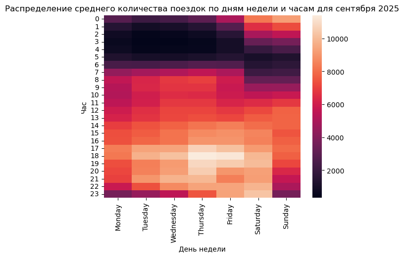
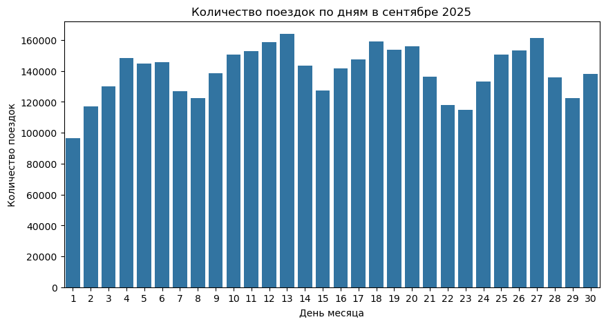
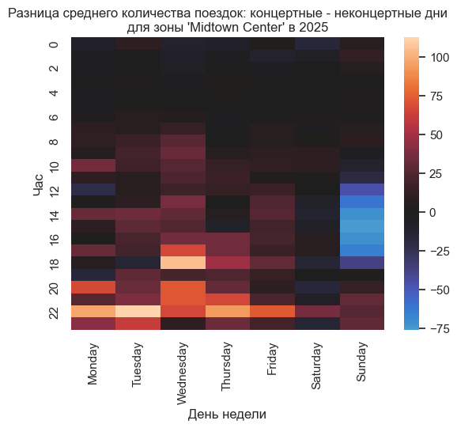
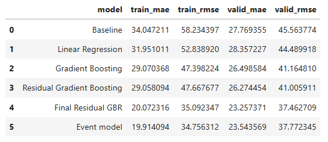

# Влияние концертов на локальный спрос на Yellow Taxi в Нью-Йорке

## Цель проекта

Проверить, помогает ли информация о проведении концертов прогнозировать локальный спрос на Yellow Taxi вблизи концертных площадок Манхэттена.

## Исследовательский вопрос

Отличается ли почасовой спрос на Yellow Taxi вблизи крупных концертных площадок в дни проведения концертов от обычных дней и улучшает ли признак наличия концерта прогноз спроса?

## Мотивация

Недавно вместе со своими подругами я была на концерте в другом городе. После концерта мы должны были сесть на поезд, поэтому, как только мы вышли из зала, начали вызывать такси. Каршеринга поблизости не было, желания водить ночью в малознакомом городе тоже, а нам надо было как можно скорее успеть на вокзал, поэтому общественный транспорт мы не рассматривали.

Однако такси вызвать не получалось: вокруг стояли сотни людей, которые, как и мы, пытались нажать кнопку «Заказать такси».

Эта ситуация заставила меня задуматься: что, если создать модель, которая, имея информацию об афише — времени начала мероприятия, численности аудитории и местоположении, — сможет прогнозировать подобные всплески спроса и заранее оповещать об этом водителей?

Такой функционал мог бы помочь одним людям быстрее уехать после мероприятия, а другим — получить больше заказов за смену.

## Целевая переменная

Количество посадок Yellow Taxi (`pickups`) в Taxi Zone за час.

## Данные

- NYC TLC Yellow Taxi Trip Records — поездки такси;
- setlist.fm API — даты концертов и концертные площадки;
- NYC TLC Taxi Zones — география Taxi Zone.

В исследовании использовались пять концертных площадок Манхэттена:
- Madison Square Garden;
- Radio City Music Hall;
- Isaac Stern Auditorium;
- Webster Hall;
- Beacon Theatre.

Для каждой площадки была определена соответствующая Taxi Zone.

## Получение данных

Исходные данные для такси не включены в репозиторий из-за большого размера файлов и ограничений GitHub.
Для воспроизведения проекта нужно скачать данные о поездках на сайте NYC TLC (https://www.nyc.gov/site/tlc/about/tlc-trip-record-data.page). Необходимо выбрать данные за 2025 год и скачать 12 parquet-файлов Yellow Taxi Trip Records. Файлы необходимо поместить в папку: data/raw/.

Остальные данные о зонах такси уже подготовлены и находятся в этой же папке проекта.

### Распределение данных такси
Перед выделением данных из выбранных зон такси, было проведено исследование количества поездок на жёлтых такси во всех зонах в зависимости от временных признаков. Например, ниже представлены графики сентября 2025 года.

Интересно, что 1 сентября 2025 года в США отмечался федеральный праздник — День труда, и его влияние на количество поездок заметно. Аналогичное влияние заметно и в другие значимые для американцев праздники.

## Основная идея

Для каждой комбинации `Taxi Zone × hour` рассчитывается количество посадок Yellow Taxi.

Для каждой выбранной площадки формируется бинарный признак `event_day`, показывающий, проводился ли в этот день концерт.

Сначала проводится EDA и сравнивается почасовая динамика поездок в концертные и неконцертные дни. Например, ниже представлен heatmap для зоны 161 - Midtown Center, в которой находится  Radio City Music Hall:

После этого строятся модели прогноза количества посадок и проверяется, улучшает ли добавление `event_day` качество прогноза.

## Моделирование

Данные разделены по времени:

- train — январь–сентябрь;
- validation — октябрь;
- test — ноябрь–декабрь.

В качестве простого baseline используется количество поездок в той же зоне и в тот же час неделю назад (`lag_168`).

Далее были рассмотрены:
- Linear Regression;
- Gradient Boosting Regressor;
- Residual Gradient Boosting Regressor.

В финальной модели Gradient Boosting прогнозирует отклонение от недельного baseline:

`pickups = lag_168 + predicted_residual`

Модель была настроена на validation, после чего её параметры были зафиксированы и проведена финальная проверка на test.

## Результаты

Недельный `lag_168` оказался сильным baseline.

Настроенный на валидации Residual Gradient Boosting позволил улучшить прогноз по сравнению с исходными моделями.

Однако добавление бинарного признака event_day не дало устойчивого заметного улучшения качества. На validation модель с концертным признаком показала немного худший результат, а на независимой test-выборке — лишь незначительно лучший. Ниже представлена таблица со значениями ошибок на обучающей выборке и валидации для использованных в работе моделей:

Строка 0 соответствует baseline модели. Строка 4 - финальной версии модели, которая не использует информацию о концертах. Строка 5 - финальной версии модели, которая обучена на выборке с признаком event_day. 

Дополнительный анализ вечерних часов и отдельных площадок также не показал устойчивого эффекта, который воспроизводился бы на test.

Таким образом, в имеющемся виде информация только о факте проведения концерта в конкретный день не даёт дополнительной предиктивной ценности поверх исторических и календарных признаков.

## Ограничения

- Setlist.fm не предоставляет время проведения концерта и численность аудитории, поэтому основной признак строится на уровне дня проведения концерта.
- TLC содержит фактически совершённые поездки, а не все запросы пользователей на такси, поэтому число `pickups` используется как приближение локального спроса.
- Доступен только один год наблюдений, поэтому для некоторых площадок число концертных дат невелико.
- Все концерты представлены одинаковым бинарным признаком, хотя мероприятия могут сильно различаться по популярности исполнителя и численности аудитории.

## Перспективы проекта

- Найти источник, содержащий время проведения концерта, количество проданных билетов или фактическую посещаемость. В открытом доступе необходимый объём таких данных найти не удалось.
- Расширить период наблюдений и количество концертных площадок.
- Рассматривать не только Yellow Taxi, но и поездки, заказанные через приложения.
- Расширить исследование на другие районы Нью-Йорка.
- Рассматривать не только концерты, но и другие крупные мероприятия и сравнивать их влияние на локальный спрос на такси.
